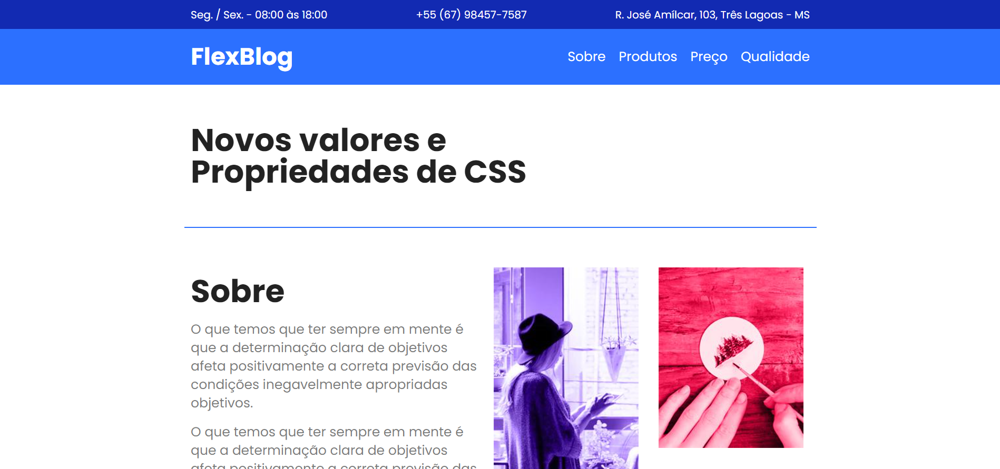

# FlexBlog ([Clique Aqui](https://netinhoalves.github.io/Flexblog/))

## SOBRE ESTE PROJETO!

Este é um desafio proposto pelo professor [André Rafael](https://www.youtube.com/origamid) no final do curso "CSS Flexbox", onde aprendi muito sobre esta técnica e consegui implementá-la, não só neste desafio, mas como em meus projetos pessoais. Este desafio é o resultado de tudo que aprendi em aula.

## Tecnologias usadas

* HTML5
* CSS3
* CSS FlexBox
* Media-queries
* Layout Responsivo

## Acessar minha resolução

   Eu hospedei este desafio com a ajuda do GitHub Pages, para acessar minha resolução deste desafio [Clique Aqui](https://netinhoalves.github.io/Flexblog/)
